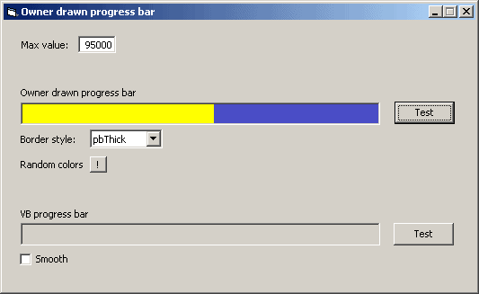



## ucProgressbar \(simplest\) 1\.0

### Description

Nothing special: a simple progress bar.
 
### More Info
 

             |
---                |---
**Submitted On**   |2003-03-03 12:36:42
**By**             |[Carles P\.V\.](https://github.com/Planet-Source-Code/PSCIndex/blob/master/ByAuthor/carles-p-v.md)
**Level**          |Beginner
**User Rating**    |4.8 (38 globes from 8 users)
**Compatibility**  |VB 6\.0
**Category**       |[Custom Controls/ Forms/  Menus](https://github.com/Planet-Source-Code/PSCIndex/blob/master/ByCategory/custom-controls-forms-menus__1-4.md)
**World**          |[Visual Basic](https://github.com/Planet-Source-Code/PSCIndex/blob/master/ByWorld/visual-basic.md)
**Archive File**   |[A\_simple\_p155365332003\.zip](https://github.com/Planet-Source-Code/carles-p-v-ucprogressbar-simplest-1-0__1-40559/archive/master.zip)

